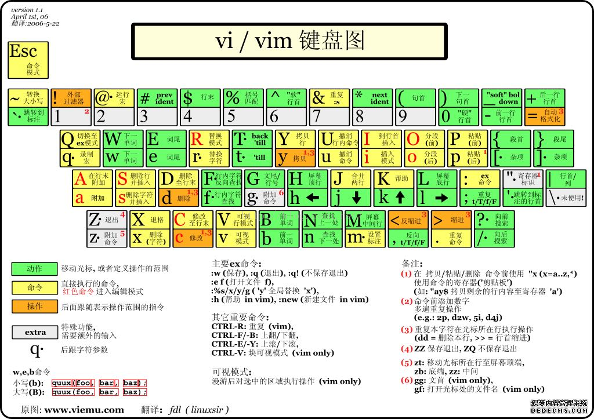

Markdown 的目标是实现 「易读易写」。

## 兼容 HTML
Markdown 语法的目标是：成为一种适用于网络的书写语言。

Markdown 不是想要取代 HTML，甚至也没有要和它相近，它的语法种类很少，只对应 HTML 标记的一小部分。Markdown 的构想不是要使得 HTML 文档更容易书写。在我看来， HTML 已经很容易写了。Markdown 的理念是，能让文档更容易读、写和随意改。HTML 是一种发布的格式，Markdown 是一种书写的格式。就这样，Markdown 的格式语法只涵盖纯文本可以涵盖的范围。

不在 Markdown 涵盖范围之内的标签，都可以直接在文档里面用 HTML 撰写。不需要额外标注这是 HTML 或是 Markdown；只要直接加标签就可以了。

加入一段表格：
<table>
    <tr>
        <td>表格头1</td>
        <td>表格头1</td>
        <td>表格头1</td>
        <td>表格头1</td>
        <td>表格头1</td>
    </tr>
    <tr>
        <td>内容</td>
        <td>内容</td>
        <td>内容</td>
        <td>内容</td>
        <td>*内容*</td>
    </tr>
</table>

<a href="http://www.baidu.com">这是一个链接</a>

|hello|sdfs|
|-    |-   |
|sdfff|s   |

&copy; &nbsp; &amp; 

this is an h1    
=======

this is an h2
-------

# this is an h1
## this is an h2

> This is a blockquote with two paragraphs. Lorem ipsum dolor sit amet,
> consectetuer adipiscing elit. Aliquam hendrerit mi posuere lectus.
> Vestibulum enim wisi, viverra nec, fringilla in, laoreet vitae, risus.
> 
> Donec sit amet nisl. Aliquam semper ipsum sit amet velit. Suspendisse
> id sem consectetuer libero luctus adipiscing.

> This is a blockquote with two paragraphs.    
Lorem ipsum dolor sit amet,consectetuer adipiscing elit.  
Aliquam hendrerit mi posuere lectus.Vestibulum enim wisi, viverra nec, fringilla in, laoreet vitae, risus.

> Donec sit amet nisl. Aliquam semper ipsum sit amet velit. Suspendisse id sem consectetuer libero luctus adipiscing.

> This is the first level of quoting.
> 
> > this is nested blockquote.     
> 
> Back to the first level. 

> ## this is an h1.
> 
> * 这是一行
> + 这是二行
> - 这是三行   
> 
> code example
> 
>       return shell_exec("echo $input | $markdown_script");

1.  Bird
1.  McHale
1.  Parish

*   Lorem ipsum dolor sit amet, consectetuer adipiscing elit.
    Aliquam hendrerit mi posuere lectus. Vestibulum enim wisi,
    viverra nec, fringilla in, laoreet vitae, risus.
*   Donec sit amet nisl. Aliquam semper ipsum sit amet velit.
    Suspendisse id sem consectetuer libero luctus adipiscing.

1986\. What a great season.     
1986\. What a great season.

这是一个普通段落：

    这是一个代码区块。

Here is an example of AppleScript:

    tell application "Foo"
        beep
    end tell

    

        &copy; 2004 Foo Corporation
    

* * * 
***
******
------
- - - 

This is [an example](http://example.com/ "Title") inline link.

[This link](http://example.net/) has no title attribute.

This is [an example][id] reference-style link.  
This is [an example][id] reference-style link.

[id]: http://example.com/  "Optional Title Here"

链接内容定义的形式为：
* 方括号（前面可以选择性地加上至多三个空格来缩进），里面输入链接文字 
* 接着一个冒号
* 接着一个以上的空格或制表符
* 接着链接的网址
* 选择性地接着 title 内容，可以用单引号、双引号或是括弧包着

[foo]: http://example.com/  "Optional Title Here"
[foo]: http://example.com/  "Optional Title Here"
[foo]: http://example.com/  (Optional Title Here)

I get 10 times more traffic from [Google][1] than from
[Yahoo][2] or [MSN][3].

  [1]: http://google.com/        "Google"
  [2]: http://search.yahoo.com/  "Yahoo Search"
  [3]: http://search.msn.com/    "MSN Search"

I get 10 times more traffic from [Google][] than from
[Yahoo][] or [MSN][].

  [google]: http://google.com/        "Google"
  [yahoo]:  http://search.yahoo.com/  "Yahoo Search"
  [msn]:    http://search.msn.com/    "MSN Search"

*single asterisks*

_single underscores_

**double asterisks**

__double underscores__ 

\*this text is surrounded by literal asterisks\*

Use the `printf()` function.

A single backtick in a code span: `` ` ``

A backtick-delimited string in a code span: `` `foo` ``

Please don't use any `<blink>` tags.

到目前为止， Markdown 还没有办法指定图片的宽高，如果你需要的话，你可以使用普通的 `` 标签。

![Alt text][img1]

[img1]: http://mouapp.com/Mou_128.png  "Optional title attribute"

 http://example.com/ 

\*literal asterisks\*

